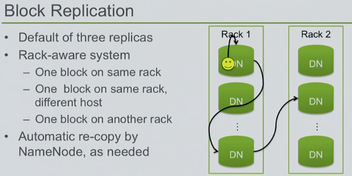

# HDFS - Hadoop File System
## HDFS Overview
- Hadoop Distributed File System is a distributed file system designed to run on commodity hardware.
- Hierarchical UNIX-like file system for data storage.
- HDFS is highly fault-tolerant, scalable and extremely simple to extend.
- HDFS is designed to be deployed on low-cost hardware (commodity hardware).
- HDFS is designed for batch processing rather than interactive use by users. The emphasis is on high throughput of data access rather than low latency of data access.
- The NameNode and DataNodes have built in web servers that makes it easy to check current status of the cluster.
- **Simple Coherency Model:** HDFS applications need a write-once-read-many access model for files.  A file once created, written, and closed need not be changed.
- Splitting of large files into blocks (Default 64 MB)
- Distribution and replication of blocks to nodes.
- Two key services
    - Master NameNode
    - Many DataNodes
- Checkpoint Node (Secondary NameNode)
- New features and improvements are regularly implemented in HDFS. The following is a subset of useful features in HDFS:
    - File permissions and authentication.
    - **Rack awareness:** to take a node’s physical location into account while scheduling tasks and allocating storage.
    - **Safemode:** an administrative mode for maintenance.
    - **fsck:** a utility to diagnose health of the file system, to find missing files or blocks.
    - **fetchdt:** a utility to fetch DelegationToken and store it in a file on the local system.
    - **Balancer:** tool to balance the cluster when the data is unevenly distributed among DataNodes.
    - **Upgrade and rollback:** after a software upgrade, it is possible to rollback to HDFS’ state before the upgrade in case of unexpected problems.
    - **Secondary NameNode:** performs periodic checkpoints of the namespace and helps keep the size of file containing log of HDFS modifications within certain limits at the NameNode.
    - **Checkpoint node:** performs periodic checkpoints of the namespace and helps minimize the size of the log stored at the NameNode containing changes to the HDFS. Replaces the role previously filled by the Secondary NameNode, though is not yet battle hardened. The NameNode allows multiple Checkpoint nodes simultaneously, as long as there are no Backup nodes registered with the system.
    - **Backup node:** An extension to the Checkpoint node. In addition to checkpointing it also receives a stream of edits from the NameNode and maintains its own in-memory copy of the namespace, which is always in sync with the active NameNode namespace state. Only one Backup node may be registered with the NameNode at once.

## HDFS Architecture


### NameNode
- Single master service for HDFS
- Single point of failure (HDFS-1.x, Node High Availability in HDFS-2.x)
- Stores file to block to location mappings in the namespaces
- All transactions are logged to disk
- NameNode startup reads namespace image and logs
- NameNode executes file system namespace operations like opening, closing, and renaming files and directories. 
- NameNode determines the mapping of blocks to DataNodes.
- Name Node knows about entire network topology.
- Rack awareness policy should be defined for replica
- Data Transfer will be less if 2 copies are save on same rack.
- Name Node- SPOF (Single point of Failure)
- FsImage - File Space Image  - exist in Memory - State of the HDFS
- EditLog - exist in disk, not in memory

### DataNode
- Stores blocks on local disk
- Send frequent heartbeats to NameNode
- Send block reports to NameNode
- Clients connect to DataNode for I/O
- DataNodes are responsible for serving read and write requests from the file system’s clients. 
- DataNodes perform block creation, deletion, and replication upon instruction from the NameNode

### Checkpoint Name (Secondary NameNode)
- Performs checkpoints of the NameNode’s namespace and logs
- Not a hot backup
- Loads up namespace
- Reads log transactions (editLog) to modify namespace
- Saves namespace as a checkpoint

A Checkpoint Node was introduced to solve the drawbacks of the NameNode. The changes are just written to edits and not merged to fsimage during the runtime. If the NameNode runs for a while edits gets huge and the next startup will take even longer because more changes have to be applied to the state to determine the last state of the metadata.

The Checkpoint Node fetches periodically fsimage and edits from the NameNode and merges them. The resulting state is called checkpoint. After this is uploads the result to the NameNode.

### Backup Node
- Backup node provides the same functionality like check point node as well as maintaining an in-memory, up-to-date copy of the file system namespace
- Along with accepting a journal stream of file system edits from the NameNode and persisting this to disk, the Backup node also applies those edits into its own copy of the namespace in memory, thus creating a backup of the namespace.
- The Backup node does not need to download fsimage and edits files from the active NameNode in order to create a checkpoint, as would be required with a Checkpoint node or Secondary NameNode, since it already has an up-to-date state of the namespace state in memory. The Backup node checkpoint process is more efficient as it only needs to save the namespace into the local fsimage file and reset edits.

### DFS Admin Commands: (DFSAdmin) [Reference](http://hadoop.apache.org/docs/current/hadoop-project-dist/hadoop-hdfs/HDFSCommands.html#dfsadmin)
- ```/bin/hdfs dfsadmin``` commands supports a few HDFS Administration related operations.
- ```dfsadmin -help```
- ```-report``` reports basic statistics of hdfs. Some information is also available on the NameNode front page
- ```-safemode``` an administrator can manually enter/leave SafeMode.
- ```finalizeUpgrade``` removes previous backup of the cluster made during last upgrade.
- ```refreshNodes``` Update the NameNode with the set of DataNodes allowed to connect to the namenode.
- ```-printTopology``` Print the topology of the cluster. Display a tree of racks and datanodes attached to the tracks as viewed by the NameNode.

### Data Replication
- Replication factor information is stored in NameNode
- Blocks of a file are replicated for fault tolerance
- All blocks in a file except the last block are the same size
- Block size and replication factor are configurable per file
- NameNode makes all decision regarding replication of blocks. It periodically receives a Heartbeat and a Blockreport from each of the DataNodes in the cluster
- Block reports contains a list of all blocks on a DataNode
- The purpose of a **rack-aware replica** placement policy is to improve data reliability, availability, and network bandwidth utilization.

### Persistence of File System Metadata
- HDFS namespace is stored by the NameNode. 
- NameNode uses a transaction log called the EditLog to persistently record every change that occurs to file system metadata. NameNode uses a file in its local host OS file system to store the EditLog. 
- The entire file system namespace, including the mapping of blocks to files and file system properties, is stored in a file called the FsImage. The FsImage is stored as a file in the NameNode’s local file system.

### Space Reclamation
- Deleted by user/ or an application
- Move in ```/trash``` directory
- A file remains in /trash for a configurable amount of time. After the expiry of its life in /trash, the NameNode deletes the file from the HDFS namespace.
- A user can Undelete a file after deleting it as long as it remains in the /trash directory.
- **Decrease Replication Factor:** When the replication factor of a file is reduced, the NameNode selects excess replicas that can be deleted. The next Heartbeat transfers this information to the DataNode. The DataNode then removes the corresponding blocks and the corresponding free space appears in the cluster.

### Major HDFS Terms:
- Safe Mode- NameNode
- ```fsck``` command
- ```fetchdt``` command - fetch delegation token
- Balancer
- Rack Awareness
- Import Checkpoint
- HFTP
- Quotes – Name Quotes/ Space Quotes
- Transparent Encryption in HDFS
- HDFS Support for Multihomed Networks





### HDFS 2.0 Features
- NameNode High-Availability (HA)
    - Two redundant NameNodes in active/passive configuration
    - Manual or automated failover
- NameNode Federation
    - Multiple independent NameNodes using the same collection of DataNodes

### High Availability Cluster Architecture: ([Quorum Journal Manager](https://hadoop.apache.org/docs/stable/hadoop-project-dist/hadoop-hdfs/HDFSHighAvailabilityWithQJM.html))
- In a typical HA cluster, two separate machines are configured as NameNodes. At any point in time, exactly one of the NameNodes is in an Active state, and the other is in a Standby state. 
- The Active NameNode is responsible for all client operations in the cluster, while the Standby is simply acting as a slave, maintaining enough state to provide a fast failover if necessary.
- In order for the Standby node to keep its state synchronized with the Active node, both nodes communicate with a group of separate daemons called **"JournalNodes"** (JNs). When any namespace modification is performed by the Active node, it durably logs a record of the modification to a majority of these JNs. The Standby node is capable of reading the edits from the JNs, and is constantly watching them for changes to the edit log. As the Standby Node sees the edits, it applies them to its own namespace. In the event of a failover, the Standby will ensure that it has read all of the edits from the JounalNodes before promoting itself to the Active state. This ensures that the namespace state is fully synchronized before a failover occurs.
- In order to provide a fast failover, it is also necessary that the Standby node have up-to-date information regarding the location of blocks in the cluster. In order to achieve this, the DataNodes are configured with the location of both NameNodes, and send block location information and heartbeats to both.
- **Note that**, in an HA cluster, the Standby NameNode also performs checkpoints of the namespace state, and thus it is **not necessary to run a Secondary NameNode, CheckpointNode, or BackupNode in an HA cluster**. In fact, to do so would be an error. This also allows one who is reconfiguring a non-HA-enabled HDFS cluster to be HA-enabled to reuse the hardware which they had previously dedicated to the Secondary NameNode.

### Permissions and HDFS:
- HDFS implements a permissions model for files and directories that shares much of the POSIX model.
- Each file and directory is associated with an owner and a group. The file or directory has separate permissions for the user that is the owner, for other users that are members of the group, and for all other users. 
- For files, the r permission is required to read the file, and 
- The ```w``` permission is required to write or append to the file.
- HDFS also provides optional support for POSIX ACLs (Access Control Lists) to augment file permissions with finer-grained rules for specific named users or named groups. 
-   If permission check fails, then “Client Operation” will fails.

### Transparent Encryption in HDFS:
HDFS implements transparent, end-to-end encryption. Once configured, data read from and written to special HDFS directories is transparently encrypted and decrypted without requiring changes to user application code. This encryption is also end-to-end, which means the data can only be encrypted and decrypted by the client. HDFS never stores or has access to unencrypted data or unencrypted data encryption keys. This satisfies two typical requirements for encryption: at-rest encryption (meaning data on persistent media, such as a disk) as well as in-transit encryption (e.g. when data is travelling over the network).
- Application-level encryption
- Database-level encryption
- Filesystem-level encryption
- Disk -level encryption

### HDFS Support for Multihomed Networks:
In multihomed networks the cluster nodes are connected to more than one network interface. There could be multiple reasons for doing so.

1. **Security:** Security requirements may dictate that intra-cluster traffic be confined to a different network than the network used to transfer data in and out of the cluster.
2. **Performance:** Intra-cluster traffic may use one or more high bandwidth interconnects like Fiber Channel, Infiniband or 10GbE.
3. **Failover/Redundancy:** The nodes may have multiple network adapters connected to a single network to handle network adapter failure.

### Archival Storage, SSD & Memory:
Archival Storage is a solution to decouple growing storage capacity from compute capacity. Nodes with higher density and less expensive storage with low compute power are becoming available and can be used as cold storage in the clusters. Based on policy the data from hot can be moved to the cold. Adding more nodes to the cold storage can grow the storage independent of the compute capacity in the cluster.

The frameworks provided by Heterogeneous Storage and Archival Storage generalizes the HDFS architecture to include other kinds of storage media including SSD and memory. Users may choose to store their data in SSD or memory for a better performance.


### Hadoop vs. RDBMS / Traditional Systems
|HADOOP | RDBMS / Traditional System|
|------------|-------------|
|Big Volume (Petabytes) | Low Volume (Gigabytes)|
|Dynamic Schema | Static Schema|
|Linear scale (Horizontal and vertical) | Nonlinear scale (Vertical) – add more resource in existing, add more index, modify query.|
|Commodity Hardware | Specialized Hardware|
|Batch | Interactive and Batch|
|Cost Effective | Costly|
|Write once and Read many times | Read , write many times|

### Hadoop Notes:
- ```hdfs-site.xml```: which list the property to configure the HDFS and configure during cluster set-up.
    - ```/etc/Hadoop/config```
    - ```vi /etc/hadoop/conf/hdfs-site.xml```
- [Ref](https://hadoop.apache.org/docs/current/hadoop-project-dist/hadoop-hdfs/hdfs-default.xml)

### Hadoop Commands:
- All Hadoop command start with “hadoop fs”.
- ```hadoop fs –ls /``` list the files from HDFS from root directory
- ```hdfs hdfs fsck```
- ```fsck``` File system check
- If MapReduce is to be used, then the MapReduce Job History Server will also be running.

### Daemon and Environment Variables
Daemon | Environment Variable
----|----
NameNode | HADOOP_NAMENODE_OPTS
DataNode | HADOOP_DATANODE_OPTS
Secondary NameNode | HADOOP_SECONDARYNAMENODE_OPTS
ResourceManager | YARN_RESOURCEMANAGER_OPTS
NodeManager | YARN_NODEMANAGER_OPTS
WebAppProxy | YARN_PROXYSERVER_OPTS
Map Reduce Job History Server | HADOOP_JOB_HISTORYSERVER_OPTS

### Web Interface:
Daemon | Web Interface | Notes
-------| ------- | ------
NameNode | http://nn_host:port/ | Default HTTP port is 50070.
ResourceManager | http://rm_host:port/ | Default HTTP port is 8088.
MapReduce JobHistory Server | http://jhs_host:port/ | Default HTTP port is 19888

### Hadoop Commands: 
- [Commands Guide](http://hadoop.apache.org/docs/current/hadoop-project-dist/hadoop-common/CommandsManual.html)
- [File system commands](http://hadoop.apache.org/docs/current/hadoop-project-dist/hadoop-common/FileSystemShell.html)

### Administrative Commands:
- ```hadoop daemonlog -getlevel <host:httpport> <classname>```
- ```hadoop daemonlog -setlevel <host:httpport> <classname> <level>```

### Non-High Availability Cluster
- Primary Name Node
- Secondary Name Node - Only on local.
- Checkpoint Name Node - Send the Merge FSImage file back to Primary Name node
- Back-up Name Node - Memory

### High Availability Cluster
- Primary Name Node - Active
- Stand By Name Node - Passive

## Questions for further investigation
### June-04-2016

1. Can we modify the content the files on HDFS?
